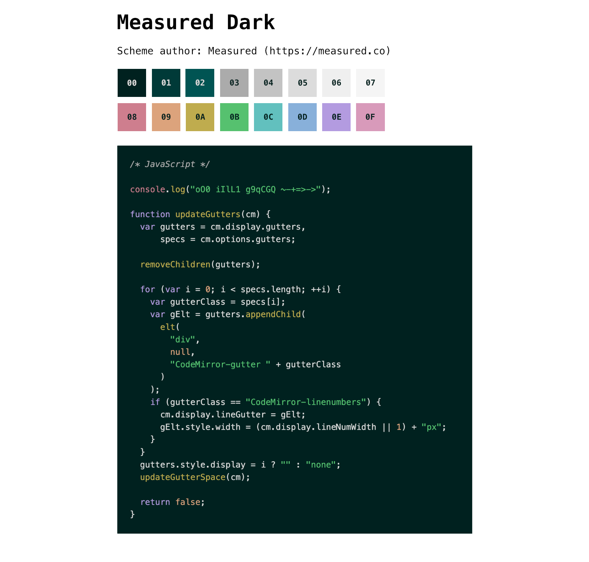
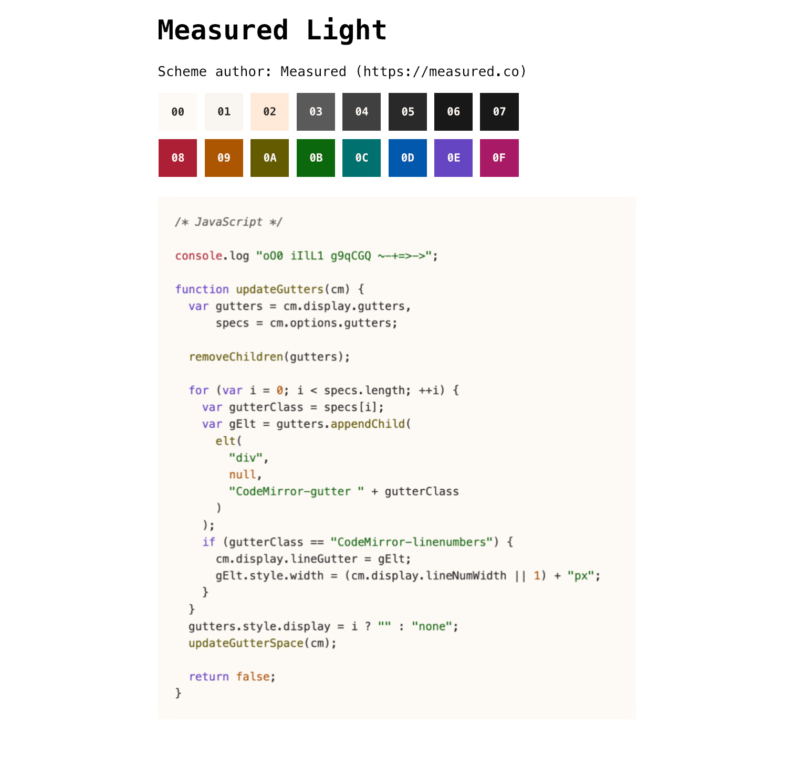

# Base16 Measured

[Base16](https://github.com/chriskempson/base16) colour schemes from [Measured](https://measured.co), with accessible colour contrast [(WCAG conformant](https://www.w3.org/TR/WCAG22/#contrast-minimum)).

## Previews

## Included

- [Highlight.js themes](built/highlightjs/themes)
- [iTerm2 itermcolors](built/iterm2/itermcolors)
- [JetBrains colors](built/jetbrains/colors/)
- [Styles](built/styles)
  - [CSS classes](built/styles/css)
  - [CSS custom properties](built/styles/css-variables)
  - [Less](built/styles/less)
  - [Sass](built/styles/sass)
  - [SCSS](built/styles/scss)
  - [Stylus](built/styles/stylus)
- [VSCode themes](built/vscode/themes)

## Build

To build other templates, use the YAML files with a builder such as [base16-builder-node](https://github.com/tinted-theming/base16-builder-node).
